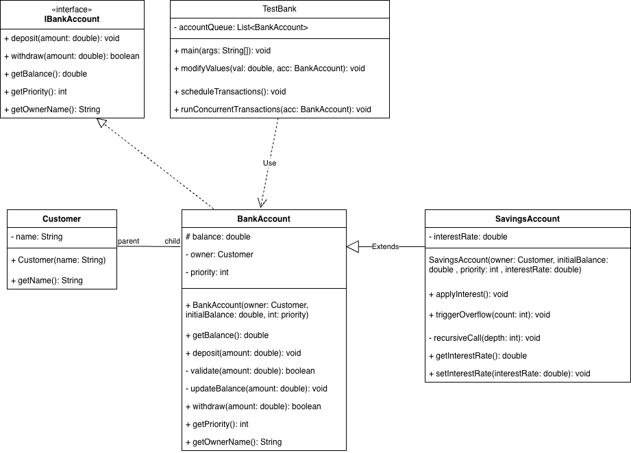

# 🏦 Bank Management System: Implementation & Memory Logic Guide

This document explains the logic behind each class to ensure every team member understands their specific part and how it connects to the overall system and Java memory management (Stack & Heap).

---

## 📊 System Design (UML Class Diagram)

---

## 📑 1. Interface: `IBankAccount`
**Responsibility:** Defines the "Contract" for the system.
- **What to do:** This file contains only method signatures (e.g., `deposit`, `withdraw`) without any implementation bodies.
- **Why we need it:** It ensures that any account type (Normal or Savings) follows the same set of rules and behaviors.
- **Memory Insight:** In the `TestBank` class, we use the Interface type for variables in the **Stack** to demonstrate **Abstraction**.

---

## 👤 2. Entity Class: `Customer`
**Responsibility:** Data storage for the account owner.
- **What to do:** Create private attributes like `name` and a standard constructor.
- **Memory Insight:** This class represents a **Heap Object**. The `BankAccount` will not store the customer's name directly; instead, it stores a **Reference** (memory address) pointing to this `Customer` object in the Heap.

---

## ⚙️ 3. Core Logic: `BankAccount`
**Responsibility:** Managing standard transactions and demonstrating the **Call Stack**.
- **What to do:**
  - Implement the `IBankAccount` interface.
  - **Nested Method Logic:** Design the `deposit()` method to call `validate()`, which then calls `updateBalance()`.
- **Memory Insight:**
  - **Stack Pointer:** This chain of calls demonstrates how multiple **Stack Frames** are pushed onto the stack and "unwind" (pop) once finished.
  - **Encapsulation:** Using `private` for `updateBalance` shows that internal stack operations are hidden from the outside world.

---

## 💰 4. Subclass: `SavingsAccount`
**Responsibility:** Demonstrating Inheritance and Stack Errors.
- **What to do:**
  - Use `extends BankAccount` to reuse existing logic.
  - Implement the `applyInterest()` method.
  - Implement `triggerOverflow()`: A recursive method that calls itself without an exit condition.
- **Memory Insight:**
  - **Inheritance in Heap:** A `SavingsAccount` object in the Heap allocates space for both its own variables and those inherited from the parent class.
  - **StackOverflowError:** The recursive call is used to prove that the **Stack** has a limited size; the program will crash once the stack is full of frames.

---

## 🧪 5. Driver Class: `TestBank`
**Responsibility:** System execution, Priority Scheduling, and Memory Testing.
- **What to do:**
  - Maintain a `List<IBankAccount>` to act as a processing Queue.
  - **scheduleTransactions():** Logic to sort the list based on the `priority` attribute.
  - **modifyValues():** A method to demonstrate the difference between passing a `double` (Primitive) and a `BankAccount` (Reference).
- **Memory Insight:**
  - **Scheduling:** Shows that we can control the order of execution (determining which frame is pushed onto the stack first).
  - **Pass-by-Value vs. Pass-by-Reference:** Proves that changes to **Primitives** stay within their stack frame, while changes to **Objects** affect shared data in the Heap.

---

## 🛠️ Summary for Team Members
| If you are coding... | Focus on... |
| :--- | :--- |
| **`IBankAccount`** | Ensuring method signatures match the team's agreement. |
| **`BankAccount`** | The specific order of internal method calls (`deposit` -> `validate` -> `update`). |
| **`SavingsAccount`** | Implementing the recursion for the Stack Overflow demo. |
| **`TestBank`** | The list sorting logic (Priority) and the `modifyValues` test. |
